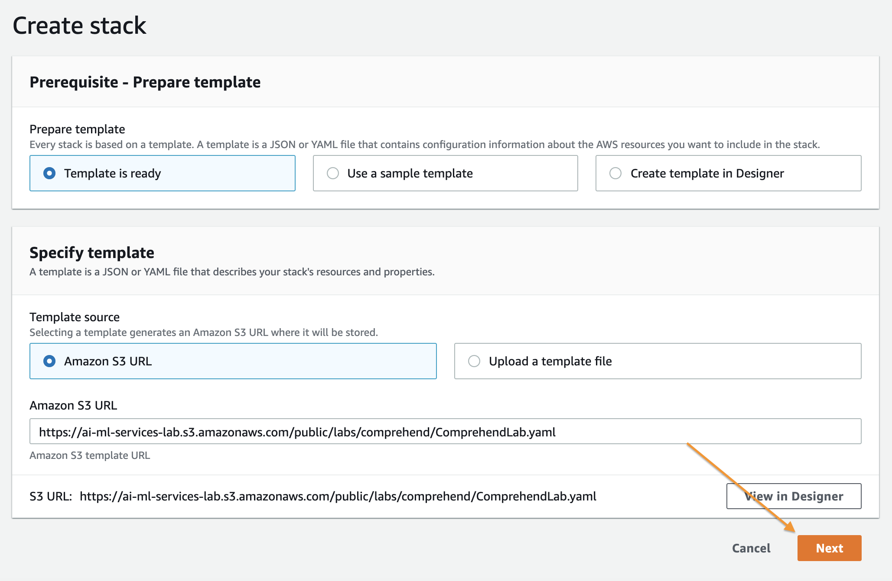
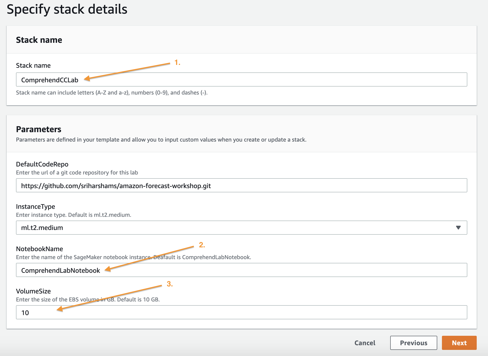
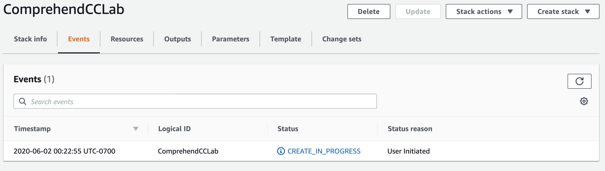
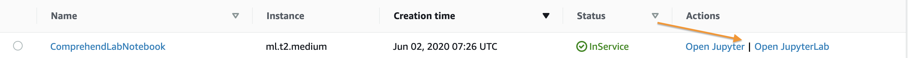

## Amazon Comprehend Workshop

Notebooks and examples on how to onboard and use various features of Amazon Comprehend Custom Classification 

## Getting Started Workshop

This is a place where you will find example to run Amazon Forecast workshop

Open the [workshop](workshop/) folder to find a CloudFormation template that will deploy all the resources you need to build your Amazon Comprehend Custom Classification. The workshop provided can also serve as a template to building your own models with your own data.

In the [*workshop*](workshop/) folder you will learn to:

1. Prepare a dataset for use with Amazon Comprehend Custom Classification.
2. Build models based on that dataset.
3. Evaluate a model's performance based on real observations.

## Process:

1. Deploying Your Working Environment
1. Run workshop lab to run Amazon comprehend custom classification
1. Cleanup

That is a genereal order to this proccess. It is recommended that you clean up and delete all the resources usef for lab.

## Deploying Your Working Environment

As mentioned above, the first step is to deploy a CloudFormation template that will perform much of the initial setup work for you. In another browser window or tab, login to your AWS account. Once you have done that, open the link below in a new tab to start the process of deploying the items you need via CloudFormation.

This CloudFormation template will compelte the following:

1. Create a SageMaker Role for your Lab
1. Create a SageMaker Notebook Instance for your Lab
1. Clone the Workshop codebase onto the Notebook Instance.

Follow along with the screenshots below if you have any questions about deploying the stack.

### Cloud Formation Wizard

Start by clicking `Next` at the bottom like this:

On this page you have a few tasks:

1. Change the Stack name to something relevant like `ComprehendCCLab`
2. Change the Notebook Name (Optional)
3. Alter the VolumeSize for the SageMaker EBS volume, default is 10GB, if your dataset is expected to be larger, please increase this accordingly.

When you are done click `Next` at the bottom.

This page is a bit longer so scroll to the bottom to click `Next`. All of the defaults should be sufficient to complete the Lab, if you have custom requirements alter as necessary.

Again scroll to the bottom, check the box to enable the template to create new IAM resources and then click `Create Stack`.

For a few minutes CloudFormation will be creating the resources described above on your behalf it will look like this while it is provisioning:

Once it has completed you'll see green text like below indicating that the work has been completed:

Now that your environment has been created go to the service page for Sageamaker by clicking `Services` in the top of the console and then searching for `SageMaker` and clicking the service.

From the SageMaker console scroll until you see the green box indicating now many notebooks you have in service and click that.

On this page you will see a list of any SageMaker notebooks you have running, simply click the `Open Jupyter` link on the Comprehend Lab notebook you have created

This will open the Jupyter environment for your POC, think of it as a web based data science IDE if you are not familiar with it. It should Automatically open the `amazon-comprehend-workshop` folder for you, but if it does not do that by clicking on the folder icon in the browser on the left side of the screen and follow the documentation below to get started with your Lab!

## Run workshop lab to run Amazon comprehend custom classification

Open [amazon-comprehend-custom-classification.ipynb](workshop/amazon-comprehend-custom-classification.ipynb) and follow along there.

Once this has completed you can move onto clean up.

## Next Steps

The next step is to either compare the results from Comprehend against a previous approach and determine which one is more performant, if Comprehend is more performant or there is no existing system then the path to production is determining how to integrate the results with planners, analysts, or other software solutions. The data again is exportable in JSON or CSV so it is easy to develop automated procedures for this integration.

## Cleanup

The scripts in this Lab provision various Comprehend, S3, and IAM resources. If you ran this Lab in your own account and would like to avoid ongoing charges related to these resources, open `Cleanup.ipynb` and run the cleanup scripts provided there. Wait for the scripts to complete, then tear down the CloudFormation stack you created at the beginning of these instructions. 

## License Summary

This sample code is made available under a modified MIT license. See the LICENSE file.
